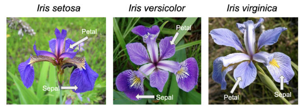
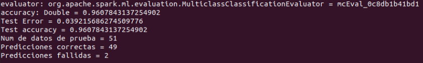

# Evaluation 2

# Libraries


```scala
import org.apache.spark.ml.classification.MultilayerPerceptronClassifier
import org.apache.spark.ml.evaluation.MulticlassClassificationEvaluator
import org.apache.spark.ml.feature.{IndexToString, StringIndexer, VectorIndexer, VectorAssembler}
```

# Load DataSet
This dataset brings us features about 3 iris flowers variants
```scala
//1.- Carga el dataset
val dat = spark.read.option("header", "true").option("inferSchema","true")csv("iris.csv")
```

# Show Columns

```scala
//2.- Nombre de las columnas
println(dat.columns.toSeq)
```

# Show Schema

```scala
//3.- Esquema
println(dat.schema)
dat.printSchema()
```

# use describe() Method

```scala
//5.-Utilizar el metodo describe
dat.describe().show()
```

# Show the first 5 columns

```scala
//6.- mostrar numero de columnas en este caso 5
dat.select(dat.columns.slice(0,5).map(m=>col(m)):_*).show()
// numero de renglones en este caso 5
dat.show(5)
```

# Transform the data into categories and labels using indexers

```scala
//7.-Transformacion para datos categoricos y etiquetas a clasificar
//etiqueta
val labelIndexer = new StringIndexer().setInputCol("species").setOutputCol("label").fit(dat)
var dat1=labelIndexer.transform(dat)
//caracteristicas
val featureIndexer = new VectorAssembler().setInputCols(Array("sepal_length","sepal_width","petal_length","petal_width")).setOutputCol("features")
var data=featureIndexer.transform(dat1)
```

# split dataset into train and test
```scala
// Separa el dataset en train y test
val splits = data.randomSplit(Array(0.6, 0.4), seed = 1234L)
val train = splits(0)
val test = splits(1)

dat.select("Species").groupBy("Species").count().show()
```

# Create the layer description
we can define the layer using an array, this array contains the input layer, the output layer, and the hidden layers.
```scala
// Especifica las capas de la red neuronal
// input layer of size 4 (features), two intermediate of size 5 and 4
// and output of size 3 (classes)
val layers = Array[Int](4, 5, 4, 3)
```

# Create model description
set the layer description to the model, also we define the setBlockSize parameter to have more entries per iteration, the iteration its defined in the setMaxIter parameter, and the setSeed parameter takes a number to create randomness.
```scala
// Crea el modelo ajustado a los parametros
val trainer = new MultilayerPerceptronClassifier().setLayers(layers).setBlockSize(128).setSeed(1234L).setMaxIter(100)
```

# Train model

```scala
// Entrenar el modelo
val model = trainer.fit(train)
```

# Extract results from the model using test dataset.
We can use the test dataset to obtain results from the model. we can also use the following code in select() functionto create a new column that inherits metadata from the dataset data, this will help to translate the index to the original label.
```scala
// Se prueba el modelo
//val result = model.transform(test)
val result = model.transform(test).select(col("*"),col("prediction").as("predictionIndex", data.schema("label").metadata))
val labelConverter = new IndexToString().setInputCol("predictionIndex").setOutputCol("predictedLabel")
val prediction = labelConverter.transform(result)
val labelsPrediction = prediction.select("species","predictedLabel")
labelsPrediction.show()
//Se obtiene la presicion
val evaluator = new MulticlassClassificationEvaluator().setMetricName("accuracy")
val accuracy = evaluator.evaluate(prediction)
println(s"Test Error = ${(1.0 - accuracy)}")
println(s"Test accuracy = ${accuracy}")
println(s"Num de datos de prueba = ${(prediction.count())}")
println(s"Predicciones correctas = ${(prediction.where("predictedLabel == species").count())}")
println(s"Predicciones fallidas = ${(prediction.where("predictedLabel != species").count())}")
```

